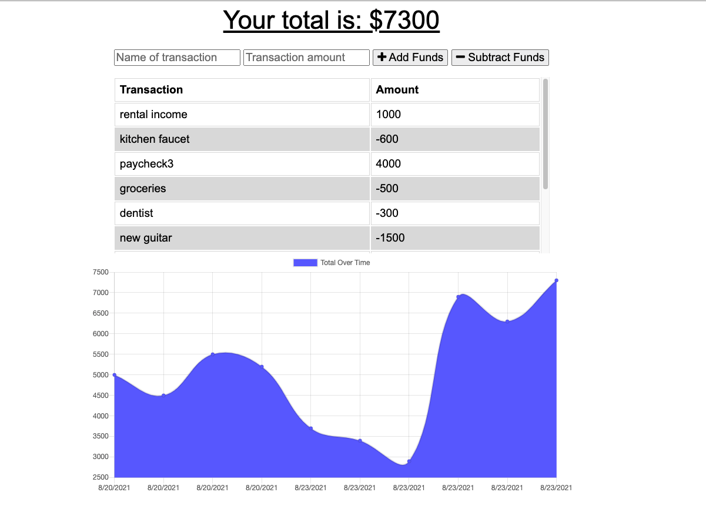

# 19 PWA

## Creating an Online/Offline Budget Tracker

This is the nineteenth assignment for the MSU Coding Bootcamp; To add the functionality to our budget tracking app so we can allow for offline access and still save and update budget data when back online, and to deploy it on Heroku.  Using Mongoose with a Mongo database, and Express router, the app will also utilize MongoDB Atlas.

The app allows a user to track an online budget. The user can add expenses and deposits to the budget whether the app is online or offline.  The offline transactions will populate the total when brought back online.

### Live Links
- [Daniel Shoup's Budget Tracker Repisitory](https://github.com/danshoup/BudgetTracker)
- [Daniel Shoup's link to the deployed Budget Tracker on Heroku](https://budget-tracker-msu-2021.herokuapp.com/)

### Budget Tracker Screenshot

## Acceptance Criteria
- User is able to use the budget app without an internet connecdtion.

- When the user makes a deposit or withdrawl offline, it will cached and will be added to the history when back online

- Folder structure follows the MVC paradim.

- App uses the 'express-handlebars' package to implement Handlebars.js for Views

- UI is is clean and polished, and user experience is intuitive and easy to navigate.

- Application resembles the mock-up provided in the homework instructions.

- Application must be deployed to Heroku

- Application must be deployed at a live URL, and load with no errors.

- GitHub URL must be submitted, and the repository must contain the application code.

- Application console is free of errors.

- Repository has a unique name and follows best practices for naming, indentation, comments, and contains descriptive commit messages.  The repository also contains a quality READMY file with description, screenshot,a nd link to deployed application.

- URL of the functional, deployed application, and the URL of the GitHub repository must be submitted.

